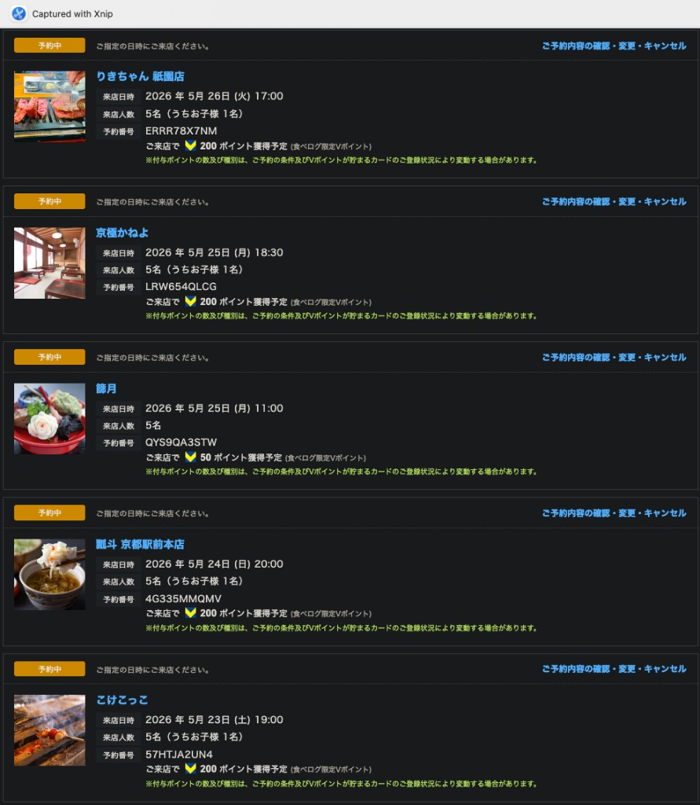

# 京都旅遊行程 2026年5月（v2）
**成員：** 4大人 + 1小孩（小學三年級，約9歲）
**住宿：** [No.8 Kyoto](https://maps.app.goo.gl/hCLb4mfnbbQLyyXj9)（7-2 Higashikujo Kamigoryocho, Minami Ward；京都車站八條口步行**6分鐘**，約450m，5/23–5/26 共4晚）
**母親注意：** 行動不便，全程優先坡道與平路，避免大量階梯

---

## 出發前待辦清單

- [ ] 購買 **HARUKA 外國旅客優惠單程票**（4大1小，KIX → 京都）
  - ⚠️ ICOCA & HARUKA 來回套票已於 2023/9/30 停售，請勿購買
  - 購買管道：[JR West 官網](https://www.westjr.co.jp/travel-information/en/tickets-passes/oneway/haruka/) / KKday / Klook 電子票，持護照進站掃碼
- [ ] 抵達**京都站**後購買 **ICOCA 卡 × 5張**（每張含押金與儲值）— JR West 窗口或自動售票機（不在 KIX 買，避免佔用趕 Haruka 的時間）
- [x] **嵯峨野小火車**（5/25 13:05 トロッコ嵐山→トロッコ亀岡）✅ 已購票
- [x] **保津川遊船** 5/25 14:00 班次 ✅ 已預約
- [x] **[Yamato Transport Namba Station Center（ヤマト運輸なんばステーションセンター）](https://maps.app.goo.gl/nJ5nQwonh8bcEPbE6)** 行李寄放（5/27 使用）✅ 已預約 09:00–17:30 ／ 中央区難波4丁目4-4（距南海難波駅 步行2分鐘/140m）
- [ ] ⚠️ **購買近鐵特急指定席**（5/24 近鐵奈良→近鐵京都 18:34，大人4＋兒童1）— [近鉄 Web 購票](https://www.kintetsu.co.jp/railway/ticket/express_web/)
- [x] **晚餐訂位**（こけこっこ／瓢斗／京極かねよ／りきちゃん）✅ 已同步至下方行程；截圖備份見文末附錄
- [ ] 備妥**現金**：清水寺不收刷卡；日本多處小店亦僅收現金

---

## 5/23（六）抵達日

| 時間 | 行程 | 路線規劃 | 備註 |
|------|------|----------|------|
| 07:45 | IT710 桃園起飛 | — | |
| 11:30 | 抵達關西機場，通關取行李 | — | |
| 11:45 | 前往 Haruka 月台 | — | 入境大廳直走 JR West 服務台購買 Haruka 優惠票（若尚未預購）|
| 12:44 | 搭 **Haruka 特急** 前往京都 | [はるか 12:44→14:04](https://maps.app.goo.gl/GhQP5wyCTnqUF54V9) | ⚠️ Plan B（趕不上）：次班 13:14発→14:34着，19:00晚餐不受影響 |
| 14:04 | 抵京都車站 | — | |
| 14:10 | 購買 ICOCA 卡，前往**拉麵小路**午餐 | [步行 京都駅→拉麵小路](https://www.google.com/maps/dir/?api=1&origin=京都駅&destination=京都駅ラーメン小路&travelmode=walking) | ICOCA 在 JR West 窗口購買；11F 拉麵小路可帶行李入 |
| 15:00 | 步行至 **No.8 Kyoto** Check-in | [步行 6分 450m](https://www.google.com/maps/dir/?api=1&origin=京都駅&destination=No.8+Kyoto+京都&travelmode=walking) | |
| 19:00 | **[こけこっこ](https://maps.google.com/?q=こけこっこ+京都)** 晚餐 | — | ✅ 已預約 5名（含兒童1）；預約番号 **57HTJA2UN4** |

---

## 5/24（日）伏見稻荷 → 奈良

| 時間 | 行程 | 路線規劃 | 備註 |
|------|------|----------|------|
| 09:30 | 步行至 JR 京都站 | [步行 6分 450m](https://www.google.com/maps/dir/?api=1&origin=No.8+Kyoto+京都&destination=京都駅&travelmode=walking) | |
| 09:45 | 搭 JR 奈良線至 **JR 稻荷站** | [奈良線 09:45→09:50](https://maps.app.goo.gl/gLP3pADeukybKqJq8) | |
| 09:50–11:00 | **[伏見稻荷神社](https://maps.google.com/?q=伏見稲荷大社)** 千本鳥居入口段 | — | 石板路平緩，約1小時，不爬全程 |
| 11:39 | 搭 みやこ路快速 至 **JR 奈良站** | [みやこ路快速 11:39→12:21](https://maps.app.goo.gl/J2H4Jt65B7idFzQx8) | |
| 12:21 | 抵奈良，步行或搭巴士至 **[志津香釜飯大宮店](https://maps.app.goo.gl/MeLvUX6w5LJDxXki9)** 附近等候 | [バス10系統 12:29→12:35](https://maps.app.goo.gl/XcLaoc2ZoKMnuwoK9)（步行 11分） | ⚠️ 步行超過10分鐘，建議搭10系統公車（¥250），12:31從JR奈良站西口バス停出發；奈良市無地下鐵 |
| 13:00 | **志津香釜飯大宮店**午餐 | — | ✅ 已訂位，不可變動 |
| 14:37 | 搭公車至 **[奈良公園](https://maps.app.goo.gl/UW39aopLceEvYXVs5)** 餵鹿 | [バス163系統 14:37→15:02](https://maps.app.goo.gl/5wsRactjroCk7FSF6) | ⚠️ 步行需43分鐘，建議搭巴士；奈良市無地下鐵 |
| 15:05 | **[奈良公園](https://maps.app.goo.gl/UW39aopLceEvYXVs5)** 餵鹿（約30分鐘） | — | |
| 15:35 | 步行至 **[東大寺大佛殿](https://maps.app.goo.gl/9vrgmfQJYoGbpiH1A)** | [步行 5分](https://www.google.com/maps/dir/?api=1&origin=奈良公園&destination=東大寺大仏殿&travelmode=walking) | |
| 15:40 | **東大寺大佛殿**參觀 | — | 入口有台階，母親可選坡道側 |
| 16:45 | 步行至 **[春日大社](https://maps.app.goo.gl/vouYHbcoQAbtqwiEA)** | [步行 10分 668m](https://www.google.com/maps/dir/?api=1&origin=東大寺大仏殿&destination=春日大社&travelmode=walking) | 石燈籠林道，平坦好走 |
| 17:45 | 搭巴士至 **[近鐵奈良站](https://maps.app.goo.gl/gJABNxsEWUWxW6tg8)** | [バス１系統 17:45→18:04](https://maps.app.goo.gl/CwfMV9nbFLm9d9nm9) | ⚠️ 步行需26分／2km 建議搭巴士；⚠️ 優先準時接上 18:34 近鐵特急並赴瓢斗（不回民宿）；奈良市無地下鐵 |
| 18:34 | 搭**近鐵特急**至 **[近鐵京都站](https://maps.app.goo.gl/WN9Hvd2DkKmoewvy6)** | [近鐵特急 18:34→19:15](https://maps.app.goo.gl/CHb12vZ84Nmk433y5) | ⚠️ 特急券待訂（務必對齊本班次） |
| 20:00 | **[瓢斗 京都駅前本店](https://maps.google.com/?q=瓢斗+京都駅前本店)** 晚餐（由 **[近鐵京都站](https://maps.app.goo.gl/WN9Hvd2DkKmoewvy6)** 前往） | [步行 19:22→19:34](https://www.google.com/maps/dir/34.9848253,135.7572155/Ky%C5%8Dto+Hy%C5%8Dto+Ky%C5%8Dto+Ekimae+Honten,+607-12+Higashishiokojicho,+Shimogyo+Ward,+Kyoto,+600-8216%E6%97%A5%E6%9C%AC/@34.9865825,135.7512552,16z/data=!3m1!4b1!4m13!4m12!1m0!1m5!1m1!1s0x600109ad85141237:0x3925e6c687436931!2m2!1d135.755304!2d34.9885603!2m3!6e0!7e2!8j1779650520!3e2?hl=zh-TW&entry=ttu&g_ep=EgoyMDI2MDUxMy4wIKXMDSoASAFQAw%3D%3D)；備案：[市巴士19 19:23→19:33](https://www.google.com/maps/dir/34.9848253,135.7572155/Ky%C5%8Dto+Hy%C5%8Dto+Ky%C5%8Dto+Ekimae+Honten,+607-12+Higashishiokojicho,+Shimogyo+Ward,+Kyoto,+600-8216%E6%97%A5%E6%9C%AC/@34.9865825,135.7512552,16z/data=!3m1!4b1!4m13!4m12!1m0!1m5!1m1!1s0x600109ad85141237:0x3925e6c687436931!2m2!1d135.755304!2d34.9885603!2m3!6e0!7e2!8j1779650520!3e3?hl=zh-TW&entry=ttu&g_ep=EgoyMDI2MDUxMy4wIKXMDSoASAFQAw%3D%3D) | ✅ 已預約 5名（含兒童1）；預約番号 **4G335MMQMV**／⚠️ 步行約12–13分，已附巴士備案連結（ICOCA可）；必要時計程車 |

---

## 5/25（一）嵐山全日

| 時間 | 行程 | 路線規劃 | 備註 |
|------|------|----------|------|
| 09:25 | 步行至 JR 京都站 | [步行 6分 450m](https://www.google.com/maps/dir/?api=1&origin=No.8+Kyoto+京都&destination=京都駅&travelmode=walking) | |
| 09:42 | 搭 JR 山陰線至 **[JR 嵯峨嵐山站](https://maps.google.com/?q=JR嵯峨嵐山駅)** | [山陰本線 09:42→09:59](https://maps.app.goo.gl/qxoKXreTqiqTZgmA8) | |
| 10:10 | 步行至 **[竹林小徑](https://maps.google.com/?q=嵐山竹林小径)** | [步行 10分](https://www.google.com/maps/dir/?api=1&origin=JR嵯峨嵐山駅&destination=嵐山竹林小径&travelmode=walking) | |
| 10:10–10:50 | **竹林小徑** → **[野宮神社](https://maps.google.com/?q=野宮神社+嵐山)** 散步 | — | 全程平坦；渡月橋移至下午遊船後 |
| 10:55 | 步行至 **[天龍寺](https://maps.google.com/?q=天龍寺+嵐山)** | [步行 8分](https://www.google.com/maps/dir/?api=1&origin=野宮神社+嵐山&destination=天龍寺+嵐山&travelmode=walking) | |
| 11:00 | **[天龍寺 篩月](https://maps.google.com/?q=天龍寺+篩月+嵐山)** 精進料理午餐 | — | ✅ 已訂位，不可變動；5名；預約番号 **QYS9QA3STW**；需另購庭園入場券 |
| 12:30 | 步行至 **[トロッコ嵐山站](https://maps.google.com/?q=トロッコ嵐山駅)** | [步行 4分](https://www.google.com/maps/dir/?api=1&origin=天龍寺+嵐山&destination=トロッコ嵐山駅&travelmode=walking) | |
| 13:05 | **嵯峨野小火車** トロッコ嵐山 → トロッコ亀岡 | — | ✅ 已購票，不可變動 |
| 13:35 | **京阪京都交通 直行39系統**至保津川乗船場 | 巴士 13:35→13:46 / ¥310 | ⚠️ 下車後僅5分換乘，務必第一批離開車廂；ICOCA可用；錯過則下班14:35，無法趕上遊船 |
| 14:00 | **保津川遊船**出發（約2小時）| — | ✅ 已預約；抵嵐山渡月橋附近 |
| 16:00 | 遊船抵達 → **[渡月橋](https://maps.google.com/?q=渡月橋+嵐山)** 散步 + 抹茶甜點休息 | — | 遊船靠岸處即渡月橋附近 |
| 18:30 | **[京極かねよ](https://maps.google.com/?q=京極かねよ+京都)** 晚餐 | [市巴士63 17:08→17:57](https://maps.app.goo.gl/SsYvHmpn7DChohix7) | ✅ 已預約 5名（含兒童1）；預約番号 **LRW654QLCG**；⚠️ 市巴士63於**嵐山公園**站搭乘，渡月橋一带請預留步行至站牌時間 |

---

## 5/26（二）東山漫步

| 時間 | 行程 | 路線規劃 | 備註 |
|------|------|----------|------|
| 09:30 | 步行至 JR 京都站，搭地鐵烏丸線至四条站，步行至**[錦市場](https://maps.google.com/?q=錦市場+京都)** | [烏丸線 09:30→09:50](https://maps.app.goo.gl/v5LxjzbCicnst5vE7) | |
| 10:00–11:00 | **[錦市場](https://maps.google.com/?q=錦市場+京都)** 邊走邊吃早餐 | — | |
| 11:00 | 步行至四条河原町搭**市バス207**至清水道 | [市バス207 11:08→11:29](https://maps.app.goo.gl/RtCAc7kmqnuadXUV7) | |
| 11:30 | **[清水寺](https://maps.app.goo.gl/ySG8B8N3cvg3eWca7)** 本堂 | — | ⚠️ 現金only |
| 13:00 | **[三年坂](https://maps.app.goo.gl/u7HvpVKUcXMqS2ng9) → [二年坂](https://maps.app.goo.gl/PrmZzE4CdFQ4W5cK7)** 購物閒逛，視情況安排輕食點心 | [步行](https://www.google.com/maps/dir/?api=1&origin=清水寺+京都&destination=産寧坂+京都&travelmode=walking) | ⚠️ 石板坡道有零碎台階，母親建議只走二年坂上半段精華區 |
| 14:00 | **[高台寺](https://maps.app.goo.gl/xePMw24TRQWW4TXg8)**（寧寧之道）| [步行](https://www.google.com/maps/dir/?api=1&origin=二年坂+京都&destination=高台寺+京都&travelmode=walking) | 步道平緩；小學生以下免費 |
| 15:30 | **[八坂神社](https://maps.app.goo.gl/wnxsge3FYmV4WKm28)**（免費入場）| [步行](https://www.google.com/maps/dir/?api=1&origin=高台寺+京都&destination=八坂神社&travelmode=walking) | |
| 16:00 | **[祇園 花見小路](https://maps.app.goo.gl/MSXh9Y7mq2BunvYE7)** 散步 | [步行](https://www.google.com/maps/dir/?api=1&origin=八坂神社&destination=花見小路+祇園&travelmode=walking) | ⚠️ 17:00 訂位，建議 16:45 前結束並前往餐廳 |
| 16:50 | 步行至 **[りきちゃん 祇園店](https://maps.google.com/?q=りきちゃん+祇園店)** | [步行](https://www.google.com/maps/dir/?api=1&origin=花見小路+祇園&destination=りきちゃん+祇園店&travelmode=walking) | 報到緩衝 |
| 17:00 | **[りきちゃん 祇園店](https://maps.google.com/?q=りきちゃん+祇園店)** 晚餐 | — | ✅ 已預約 5名（含兒童1）；預約番号 **ERRR78X7NM** |
| 18:30 | 步行至四条河原町（飯後逛街） | [步行 約15分](https://www.google.com/maps/dir/?api=1&origin=祇園&destination=四条河原町&travelmode=walking) | |

---

## 5/27（三）大阪 → 關西機場

| 時間 | 行程 | 路線規劃 | 備註 |
|------|------|----------|------|
| 09:20 | 退出民宿，步行至 JR 京都站 | [步行 6分 450m](https://www.google.com/maps/dir/?api=1&origin=No.8+Kyoto+京都&destination=京都駅&travelmode=walking) | 退房 deadline 10:00 |
| 09:45 | 搭 **JR＋地下鉄御堂筋線**至大阪難波 | [JR東海道線＋御堂筋線 09:45→10:31](https://maps.app.goo.gl/Z7dVYMqZnRsHrRNM7) | ⚠️ 近鐵急行不可行 |
| 10:40頃 | 步行至 **[Yamato Transport](https://maps.app.goo.gl/nJ5nQwonh8bcEPbE6)** 寄放行李 | [步行 地下鉄なんば→南海難波 8分＋2分/140m](https://www.google.com/maps/dir/34.6629331,135.5022953/南海難波駅?hl=ja&travelmode=walking) | ✅ 已預約 09:00–17:30，中央区難波4丁目4-4 |
| 11:00–12:30 | **[黑門市場](https://maps.google.com/?q=黒門市場+大阪)** 邊走邊吃 | [步行 11分 800m](https://www.google.com/maps/dir/?api=1&origin=南海難波駅&destination=黒門市場+大阪&travelmode=walking) | |
| 13:00–15:55 | **[心齋橋](https://maps.google.com/?q=心斎橋+大阪) → [道頓堀](https://maps.google.com/?q=道頓堀+大阪)** 逛街購物 | [步行](https://www.google.com/maps/dir/?api=1&origin=黒門市場+大阪&destination=心斎橋+大阪&travelmode=walking) | ⚠️ 15:55 務必停止購物，步行至北極星（5分） |
| 16:00–17:30 | **[北極星蛋包飯心齋橋本店](https://maps.app.goo.gl/FkJfmK1u1UChgzf1A)** 晚餐 | — | ✅ 已訂位 16:00，最晚 17:30 離席 |
| 17:30 | 步行至 **[Yamato Transport](https://maps.app.goo.gl/nJ5nQwonh8bcEPbE6)** 取回行李 | [步行 17:30→17:40](https://maps.app.goo.gl/72RVqDg5wkGTxyKk6) | 全程平坦 |
| 18:12 | 搭**南海本線**前往關西機場 | 南海本線 18:12→18:57 | ⚠️ 若 17:50 前抵南海難波可搭 17:55 南海特急→18:39着；最晚備案 18:25→19:12 |
| 18:57頃 | 抵關西機場，辦理 IT213 登機手續 | — | ⚠️ 距起飛約2小時，請提前完成網路報到並備妥行李寄艙 |
| 21:05 | **IT213** 關西機場起飛返台 | — | 23:00 抵桃園機場 |

---

## 附錄：日本網站餐廳訂位截圖備份

